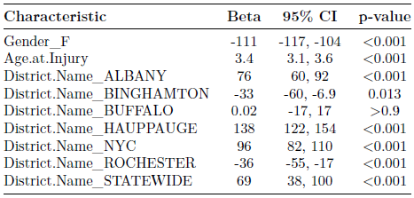

# New York Workers’ Compensation Market Analysis

## Abstract
The analysis of Disability Benefits in New York state revealed a significant “Benefit Gap” caused by themaximum weekly benefit limit of $170 when the weekly benefit calculated according to the NY Workers’ Compensation Board suggested a level of compensation significantly higher for both genders.

The formula used to calculate Lost Wage Benefits involves a “% of disability based on medical evidence”term that is very difficult to objectively valuate. Rather than simulating the disability classification process,this report calculated different payouts depending on the level of disability of a hypothetical claimant.

Similar to Disability Benefits, Lost Wage Benefits have weekly maximums but are instead adjusted yearly. Average Lost Wage Benefits in New York did not demonstrate a “Benefit Gap” as in the case of Disability Benefits due to these maximums, however the difference between the average lost wage benefit in the case of Total disability (intended to illustrate the upper extreme of payouts) and the government-imposed maximum has been growing over recent years. This means that insurance providers might have to provide significantly higher payouts in rare cases before the weekly maximum prevents them from paying any more. This suggests that less common but highly expensive claims now carry relatively more risk.

Demographic analyses were conducted on the number of claims filed by Age Group, Gender, and District. Workers in age ranges 35-49 and 50-65 filed the most claims, Male workers filed comparatively more claims than Female workers, and the most claims were filed in the NYC district. It is important to consider the composition of the labor force in interpreting these results; there is a possibility that these age ranges, Male workers, and workers located in NYC comprise the largest proportion of the labor force. It is possible that there are simply more claims filed under these characteristics as a result.

A multiple linear regression analysis was used in order to formally measure the extent to which different claim characteristics had an effect on the average payout. Payout was defined as the average weekly earnings of a claimant divided by 2, which is the Workers’ Compensation Board’s calculation for weekly disability benefits. Through an examination of the Beta coefficients of each characteristic several observations were made:

1. Female claimants had an average payout that was $111 lower than Male claimants.
2. Age had a slight positive effect on increasing the average payout.
3. On average, claims filed in Binghamton and Rochester resulted in payouts $33 and $36 lower than the
average payout.
4. On average, claims filed in NYC and Hauppauge resulted in payouts $96 and $138 higher than the
average payout. This is likely due to the relatively higher household incomes enjoyed in these districts
compared to others.

## Context
This report is a summary analysis on the state of New York’s Workers’ Compensation claims from January 2017 to March 2022. The objective of this report is to identify potentially useful trends in Disability Benefit and Lost Wage Benefit claims in order to aid Insurtech Advisors LLC’s examination of New York’s Workers’ Compensation insurance market.

## Introduction of Data
The dataset used in this analysis was retrieved from New York’s open source database Open NY, and is titled [Assembled Workers’ Compensation Claims: Beginning 2000](https://data.ny.gov/Government-Finance/Assembled-Workers-Compensation-Claims-Beginning-20/jshw-gkgu/data). This dataset contains information on 4,364,233 claims from the year 2000 to present, and 54 variables that describe the different characteristics of each claim (such as date of filing, weekly wage of claimant, etc.)
For the sake of recency, this report will only consider claims from the last five years (January 1, 2017 and
beyond), which amounts to 1,326,412 unique claims. The analysis will be conducted on a random sample of
10,000 of these claims. Any incorrect or broken observations were removed.

## Disability Benefits and the Benefit Gap
[According to the NY Workers’ Compensation Board](https://www.wcb.ny.gov/content/main/DisabilityBenefits/what-are-disability-benefits.jsp), the Disability Benefit “provides weekly cash benefits to replace, in part, wages lost due to injuries or illnesses that do not arise out of or in the course of employment”. Disability Benefits are calculated to be 50 percent of the claimant’s average weekly wage for the last eight weeks worked, with a maximum benefit of $170 per week.
The wage used to calculate total disability benefit rates for most claimants is defined as 1/52 of the Injured Worker’s average annual earnings, based on the prior year’s payroll data. Disability Benefits are typically paid out by a private insurer, either from individual or company insurance.
Below are the histograms of the calculated disability benefits for male and female claimants according to the formula used by the NY Workers’ Compensation board, which is calculated as half the weekly wage of the claimant.

We can immediately notice a significant discrepancy between the $170 maximum benefit set by the Workers’ Compensation Board and the average calculated weekly benefit. It turns out that according to the disability benefit formula (where benefit = half of the weekly wage), male claimants qualify for an average benefit of $557.41, and female claimants qualify for an average benefit of $467.06. This means that due to the $170 imposed maximum, claimants filing for disability are only receiving approximately a third of what they ought to receive according to NY’s definition of the disability benefit rate. This gap is approximately $387.41 for male claimants, and $297.06 for female claimants.

This discrepancy is further elucidated when considering the fact that the calculated disability benefits are half the weekly earnings of the claimant. The average weekly wage for male claimants is $1114.82 and for females $934.13; this means that due to the $170 maximum, male claimants are actually receiving only around 15% of their weekly income through disability benefits, and female claimants approximately 18%.

It is evident in this analysis so far that the maximum disability benefit stated by the NY Workers’ Compensation Board is likely not enough for most claimants, and it is hence likely that claimants are in need of better compensation. Based on this evidence it seems that there would be demand for an insurance product that would aim to supplement these lost benefits.

## Lost Wage Benefits
[Lost Wage Benefits are paid out after seven days of missed work due to total or partial disability](https://www.wcb.ny.gov/content/main/Workers/LostWageBenefits.jsp). The employer files a worker’s compensation claim, and the claim, if approved, will be paid out by the employer’s insurance company. If the claim is approved, payments begin 18 days after the date of injury, or within 10 days after the employer was made aware of the injury, whichever is later. During this waiting period and the period leading up to the Lost Wages claim, a claimant can apply for and receive disability benefits; however the received disability benefits will be deducted from the Lost Wages award if the case is resolved in their favour. Rather than a set maximum as in the case of the disability benefit, the maximum weekly benefit for Lost Wages is adjusted periodically. [The New York Workers’ Compensation Board’s Schedule of the Maximum Weekly Benefit](https://www.wcb.ny.gov/content/main/Workers/ScheduleMaxWeeklyBenefit.jsp) is as follows (As of March 2022):

  

The formula by which the maximum weekly Lost Wage Benefit is calculated is as follows:

  

Average weekly wage is a simple metric to consider, and can be easily retrieved from a dataset like the one we are using for the analysis. However, the other important part to this formula - the percentage of disability based on medical evidence - is much harder to obtain information on, or to even quantify.
[An article by Dr. Bruce A. Barron of the University of Rochester](https://www.aafp.org/pubs/afp/issues/2001/1101/p1579.html) describes the issues surrounding disability classification for New York Workers’ Compensation. Barron states that “the disability certification process can at times be quite contentious because of the differences among legal, administrative, socialand cultural definitions of disability”, and despite this, that “most family physicians receive little education and training on these topics”. It seems that the process of disability certification is thereby extremely subjective, so we will try observing different outcomes of the process instead in order to proceed with our benefit calculation formula.
The Workers’ Compensation Board categorizes degrees of disability into four classifications: Total (100%), Marked (75%), Moderate (50%), and Mild (25%). Rather than simulating the classification process itself (which is not possible in the scope of this report), we will determine the average weekly Lost Wage benefits for a series of hypothetical workers designated in each respective disability category.

The table above describes the average weekly Lost Wage Benefit payout for male and female claimants for each disability classification, according to the previously stated formula. Note that these averages are not calculated based on actual observed data for disability classifications, so they do not accurately reflect the frequency of such classifications. Instead, these values are the weekly benefits given that the hypothetical applicant has been classified in either of the four categories.

Our analysis of New York’s Disability Benefits revealed that there is a significant amount of income that workers forfeit due to the imposed maximum Disability Benefit of $170 per week. To try and identify whether such a gap appears due to the maximum Lost Wages Benefit as well, we will compare the average payouts for Totally disabled workers (whose payouts are highest) to the maximums for each period according to the schedule.

*Note: The period July 1, 2021 - June 30, 2022 was omitted due to a lack of observations; this period only
contained three.*

The payout gap caused by the imposed maximum benefit does not seem to pose an issue in the case of Lost Wages, as illustrated by the positive Difference calculations in the rightmost column, which computes the difference between the maximum and the average benefit for Totally disabled claimants.
However, the difference between New York’s weekly maximum benefit and the average weekly benefit paid for Lost Wages (in the case of total disability) has on average increased over the years. This could mean that an insurance provider in the Workers’ Compensation market might expect to pay out a greater sum of weekly benefits on average before the government-imposed maximum prevents them from having to pay further. A claim demanding a payout significantly higher than average might have to be fully paid nowadays, whereas the payout of such a claim five years ago would have been limited by that year’s maximum benefit schedule.

## Demographic Analysis
This section of the report will consist of a demographic analysis on our dataset of Workers’ Compensation claims.

### Claims by Age
Below is a pie chart of the different proportions of claims filed by age group:

The chart reports that claimants aged 18-24 filed 3.8% of claims, ages 25-34 filed 17.8%, ages 35-49 filed 35.8%, ages 50-65 filed 37.8%, and ages 65 and above filed 4.8%.
This chart shows that claimants in the age ranges 35-49 and 50-65 file the largest proportion of claims, with claimants aged 50-65 filing the most over all groups. This result has two potential interpretations:

1. These two groups might be filing the most claims simply because they comprise the largest proportion of the workforce itself. However this result seems unlikely based on the [U.S. Bureau of Labor Statistics’ report](https://www.bls.gov/emp/graphics/labor-force-share-by-age-group.htm) that the age group 55 to 64 comprised only 17% of the labor force in 2020.
2. More interestingly, if these two groups do not comprise the largest proportion of the workforce yet still file the most claims, this means that workers aged 35-49 and 50-65 simply have a higher propensity to file claims. This result has useful implications on risk; if an individual purchasing insurance belongs to either of these age groups, they could be subject to higher premiums in order to cover the higher level of risk they carry.

### Claims by Gender

The pie chart shows that men file approximately 23.2% more claims than women. Similar conclusions can be made from this pie chart:
1. Men might be filing more claims than women because they make up a larger proportion of the workforce. This could possibly be true, since the labor force participation rate for women is 56.6%, and for men 68.3% as of February 2022 according to the [U.S. Department of Labor’s Women’s Bureau](https://www.dol.gov/agencies/wb/data/widget).
2. This can also be interpreted as simply that men file more claims than women, and this could play a part in an insurance carrier’s evaluation of risk. An insurer could have valid reason to impose higher premiums for men seeking workers’ compensation insurance simply because men appear to be significantly more likely to file claims.

### Claims Filed by District

There might not be any novel conclusions resulting from this pie chart, since it is reasonable to assume that the large proportion attributed to NYC is simply due to its much larger relative population. However, this information could be useful as a simple demographic illustration.

## Regression Analysis on the Relationship Between Claim Characteristics and Payout
A more useful analysis could be to examine whether different characteristics of a claim or claimant have an effect on the value of their payout. To do this, we will utilize a multiple linear regression model that will determine the effects of gender, age at injury, and district have on the payout, which we define as the average weekly wage divided by 2 (NY’s calculation for the disability benefit).

*Note: The variable that checks for male gender (Gender_M) and the variable that checks whether the claim was filed in Syracuse (District.Name_SYRACUSE) were removed as a limitation of the method used to implement these variables for regression. In order to make our results statistically significant, one variable from each of these categories had to be removed. This is called the [Dummy Variable Trap, and can be read about further here.](https://www.learndatasci.com/glossary/dummy-variable-trap/)*

We want to observe the Beta column, the values of which describe the extent to which each characteristic has on the average payout. For example, a one-year increase in the age of the claimant has the effect of increasing the average payout by 3.4 dollars, or $3.40.
Based on this interpretation, we can make some very useful observations.
### Gender
The Beta for the Female variable Gender_F is -111, meaning that is a claimant is Female, their payout can be expected to be $111 less on average.
### Age
As mentioned above, a one-year increase in the age of the claimant has the effect of increasing the average payout by $3.40.
### District
The effect of each district on the payout can be seen in the above table of betas, however some districts of particular interest are Rochester, Binghamton, NYC, and Hauppauge. Binghamton and Rochester both have negative betas, which mean that on average, we can actually expect the payout to be $33 and $36 dollars less when a claim is filed in these districts, respectively.
NYC and Hauppauge have the highest betas, interestingly with Hauppauge being the highest by a significant margin. This might be a result of higher household incomes in Hauppauge compared to incomes in NYC; [According to the United States Census Bureau,](https://www.census.gov/quickfacts/fact/table/newyorkcitynewyork,hauppaugecdpnewyork/PST045221) the median household income from 2016-2020 in Hauppauge was $120,422 (in 2020 dollars), whereas the median household income in NYC was $67,046. In either case, we can conclude that claims filed in NYC and Hauppauge have the strongest effect in making the average payout for a claim higher. This is most likely due to the higher average income in these districts and that payouts are calculated as a function of income.

## Results and Conclusions
The analysis of Disability Benefits in New York state revealed a significant “Benefit Gap” caused by the maximum weekly benefit limit of $170 when the weekly benefit calculated according to the NY Workers’ Compensation Board suggested a level of compensation significantly higher for both genders.
The formula used to calculate Lost Wage Benefits involves a “% of disability based on medical evidence” term that is very difficult to objectively valuate. Rather than simulating the disability classification process, this report calculated different payouts depending on the level of disability of a hypothetical claimant.
Similar to Disability Benefits, Lost Wage Benefits have weekly maximums but are instead adjusted yearly. Average Lost Wage Benefits in New York did not demonstrate a “Benefit Gap” as in the case of Disability Benefits due to these maximums, however the difference between the average lost wage benefit in the case of Total disability (intended to illustrate the upper extreme of payouts) and the government-imposed maximum has been growing over recent years. This means that insurance providers might have to provide significantly higher payouts in rare cases before the weekly maximum prevents them from paying any more. This suggests that less common but highly expensive claims now carry relatively more risk.
Demographic analyses were conducted on the number of claims filed by Age Group, Gender, and District. Workers in age ranges 35-49 and 50-65 filed the most claims, Male workers filed comparatively more claims than Female workers, and the most claims were filed in the NYC district. It is important to consider the composition of the labor force in interpreting these results; there is a possibility that these age ranges, Male workers, and workers located in NYC comprise the largest proportion of the labor force. It is possible that there are simply more claims filed under these characteristics as a result.
A multiple linear regression analysis was used in order to formally measure the extent to which different claim characteristics had an effect on the average payout. Payout was defined as the average weekly earnings of a claimant divided by 2, which is the Workers’ Compensation Board’s calculation for weekly disability benefits. Through an examination of the Beta coefficients of each characteristic several observations were made:
1. Female claimants had an average payout that was $111 lower than Male claimants.
2. Age had a slight positive effect on increasing the average payout.
3. On average, claims filed in Binghamton and Rochester resulted in payouts $33 and $36 lower than the
average payout.
4. On average, claims filed in NYC and Hauppauge resulted in payouts $96 and $138 higher than the
average payout. This is likely due to the relatively higher household incomes enjoyed in these districts
compared to others.
